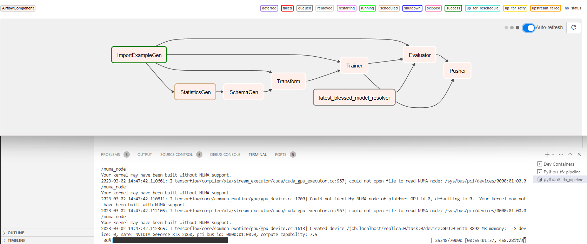

# Install Airflow
pip install virtualenv

# Init Airflow
mkdir -p ~/airflow/dags
airflow db init
airflow users  create --role Admin --username admin --email admin --firstname admin --lastname admin --password admin
export AIRFLOW__CORE__DAGBAG_IMPORT_TIMEOUT=300

# Setup DAGs
cp /workspaces/tfx_pipeline/minst_fassion_pipeline/__init__.py ~/airflow/dags/
cp /workspaces/tfx_pipeline/minst_fassion_pipeline/airflow_pipeline.py ~/airflow/dags/
cp /workspaces/tfx_pipeline/minst_fassion_pipeline/pipeline_def.py ~/airflow/dags/
cp /workspaces/tfx_pipeline/minst_fassion_pipeline/pipeline_settings.py ~/airflow/dags/
cp -R /workspaces/tfx_pipeline/minst_fassion_pipeline/components/ ~/airflow/dags/components

# Run Airflow
nohup airflow webserver -p 7000 &> webserver.out &
nohup airflow scheduler &> scheduler.out &

